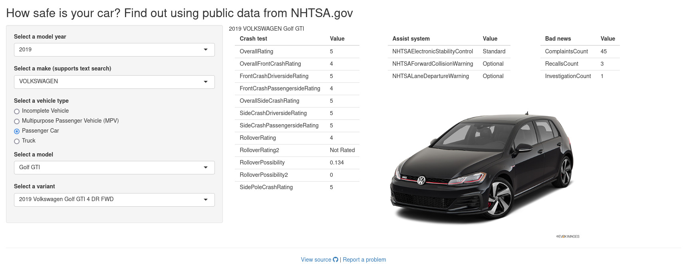

# Car safety web app

https://kaczmarj.shinyapps.io/car-safety/

An R Shiny app that displays safety information about cars. Data provided by
NHTSA.gov.



# Install

This app was written using R version 4.0.5 "Shake and Throw" and the following dependencies:

- shiny version 1.7.1
- jsonlite version 1.7.2
- curl version 4.3.2

## Run in Docker

Build and run the Docker image:

```
docker build -t car-safety .
docker run --rm -it -p 3838:3838 car-safety
```

And navigate to http://localhost:3838/.

# Description of implementation

## How vehicle selections are made

The bulk of this app involves getting the unique ID of the vehicle a user is interested in. This involves a sequence of steps.

1. We need to get a list of all of the possible vehicle makes (e.g., Volkswagen, Honda, Jeep, etc.).
    - https://vpic.nhtsa.dot.gov/api/vehicles/GetAllMakes?format=csv

      ```
      make_id,make_name
      440,ASTON MARTIN
      441,TESLA
      442,JAGUAR
      443,MASERATI
      ...
      ```

1. Later NHTSA API calls require a vehicle type (e.g., passenger car, truck, etc.). NHTSA can give us a list of all of the vehicle types a particular make includes. We assume that most people will be interested in passenger cars, so if the make includes passenger cars, we pre-select that option.
    - https://vpic.nhtsa.dot.gov/api/vehicles/GetVehicleTypesForMake/{make}?format=csv

      ```
      makeid,makename,vehicletypeid,vehicletypename
      482,VOLKSWAGEN,2,Passenger Car
      482,VOLKSWAGEN,3,"Truck "
      482,VOLKSWAGEN,7,Multipurpose Passenger Vehicle (MPV)
      482,VOLKSWAGEN,10,Incomplete Vehicle
      ```

1. We can get all of the possible vehicle models given a make, vehicle type, and year. We haven't discussed model year yet. That is selected from a dropdown, with options ranging from 1995 to 2023.
    - https://vpic.nhtsa.dot.gov/api/vehicles/GetModelsForMakeYear/make/{make}/modelyear/{year}/vehicletype/{type}

      ```
      make_id,make_name,model_id,model_name,vehicletypeid,vehicletypename
      482,VOLKSWAGEN,3133,Golf,2,Passenger Car
      482,VOLKSWAGEN,3134,Passat,2,Passenger Car
      482,VOLKSWAGEN,3137,Jetta,2,Passenger Car
      482,VOLKSWAGEN,5059,Golf SportWagen,2,Passenger Car
      482,VOLKSWAGEN,8118,e-Golf,2,Passenger Car
      482,VOLKSWAGEN,8119,Beetle,2,Passenger Car
      482,VOLKSWAGEN,13670,Golf GTI,2,Passenger Car
      482,VOLKSWAGEN,13844,Golf R,2,Passenger Car
      482,VOLKSWAGEN,24230,Golf Alltrack,2,Passenger Car
      482,VOLKSWAGEN,25871,Arteon,2,Passenger Car
      ```

1. A vehicle model might have multiple variants. For example, some vehicles might offer an all-wheel-drive and a front-wheel-drive variant. These variants have potentially different safety information, so we need to let a user choose which variant they are interested in. We can get a list of these variants (and their corresponding IDs) with an NHTSA API call.
    - https://api.nhtsa.gov/SafetyRatings/modelyear/{year}/make/{make}/model/{model}

      ```json
      {
        "Count": 1,
        "Message": "Results returned successfully",
        "Results": [
          {
            "VehicleDescription": "2019 Volkswagen Golf 4 DR FWD",
            "VehicleId": 13679
          }
        ]
      }
      ```

1. Each vehicle model variant has an associated ID. We get the ID from the previous step. Given this ID, we can retrieve the corresponding safety data.
    - https://api.nhtsa.gov/SafetyRatings/VehicleId/{ID}
    - For example, the following URL returns the safety information for the 2019 Volkswagen Golf: https://api.nhtsa.gov/SafetyRatings/VehicleId/13679

## Where displayed data comes from

All of the data displayed on the right-hand side of the web app comes from an API call to https://api.nhtsa.gov/SafetyRatings/VehicleId/{ID}. This returns a JSON object of safety information. Below is the data for the [2019 Volkswagen Golf](https://api.nhtsa.gov/SafetyRatings/VehicleId/13679).

```json
{
  "Count": 1,
  "Message": "Results returned successfully",
  "Results": [
    {
      "VehiclePicture": "https://static.nhtsa.gov/images/vehicles/13518_st0640_046.png",
      "OverallRating": "5",
      "OverallFrontCrashRating": "4",
      "FrontCrashDriversideRating": "5",
      "FrontCrashPassengersideRating": "4",
      "OverallSideCrashRating": "5",
      "SideCrashDriversideRating": "5",
      "SideCrashPassengersideRating": "5",
      "RolloverRating": "4",
      "RolloverRating2": "Not Rated",
      "RolloverPossibility": 0.134,
      "RolloverPossibility2": 0,
      "SidePoleCrashRating": "5",
      "NHTSAElectronicStabilityControl": "Standard",
      "NHTSAForwardCollisionWarning": "Standard",
      "NHTSALaneDepartureWarning": "Optional",
      "ComplaintsCount": 52,
      "RecallsCount": 3,
      "InvestigationCount": 1,
      "ModelYear": 2019,
      "Make": "VOLKSWAGEN",
      "Model": "GOLF",
      "VehicleDescription": "2019 Volkswagen Golf 4 DR FWD",
      "VehicleId": 13679
    }
  ]
}
```

We display the picture of the vehicle using `vehiclePicture` above. There are three general categories of safety information in the returned data:

1. Crash test results
1. Assist systems
1. Recalls / complaints / investigations

We subset the columns related to each category, and we transpose the data frames so that column names become row values. In the transposed form, each row has two values: the first is the name (e.g., "OverallRating") and the second is the value (e.g., "5").

## How we read data from API calls

Some API calls accept a `format` parameter, and where possible, we use `format=csv` and pass the URL to the base R function `read.csv`. When an API endpoint does not accept a `format` parameter, the endpoint returns JSON data. In that case, we use `jsonlite::fromJSON(url)`. This converts the JSON data into a data frame.

Data frames are stored as global variables to ease debugging. For instance, one can run the app and then inspect the data frames containing API data. This allows us to use the assignment operator `<<-`, which is like `<-` but assigns the value to a variable in the parent scope.

# Potential for improvement

- **Error checking** - In its current state, the app does little error checking. Here are some places where error checking would be useful:
    - Check if the NHTSA API is available. It's a free, public service, and it might be down for whatever reason. If it is down, the user should be notified that the web app will not work.
    - Handle 404 errors (and timeouts, other errors) when retrieving data from APIs. These errors should not crash the app.
    - Validate data returned by APIs.
- **User interface** - There must be a way to improve the look of this app.
